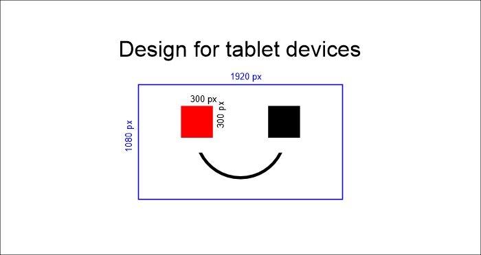
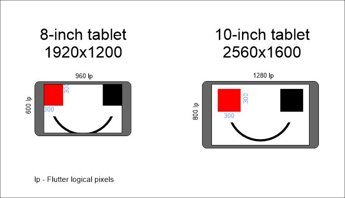
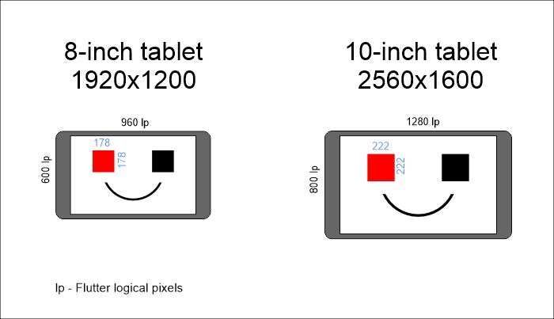
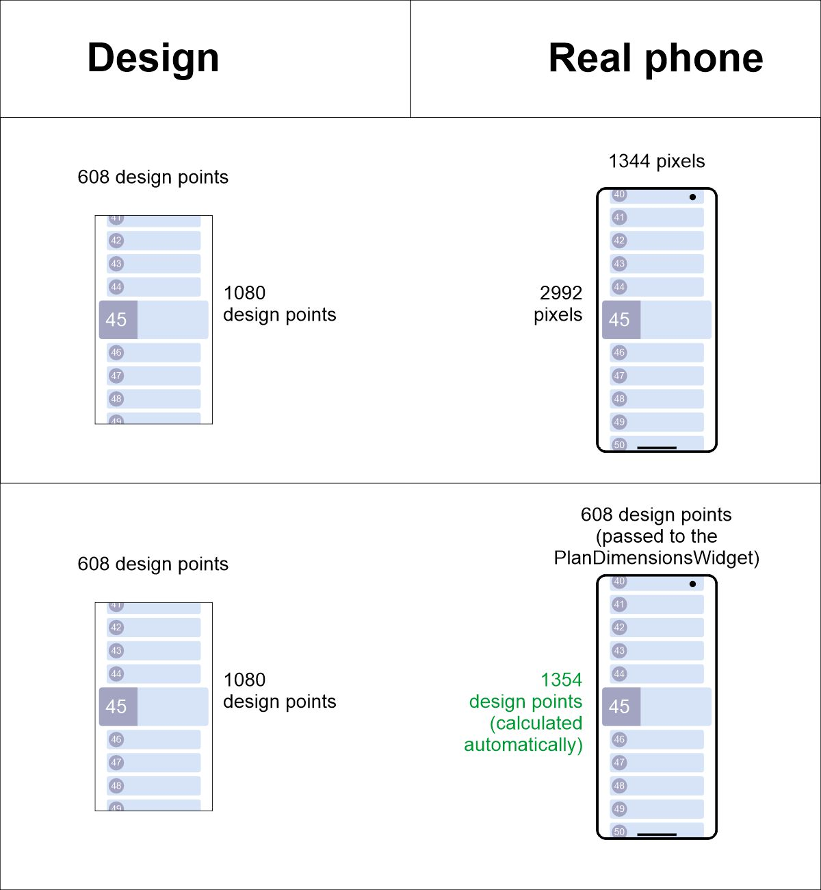
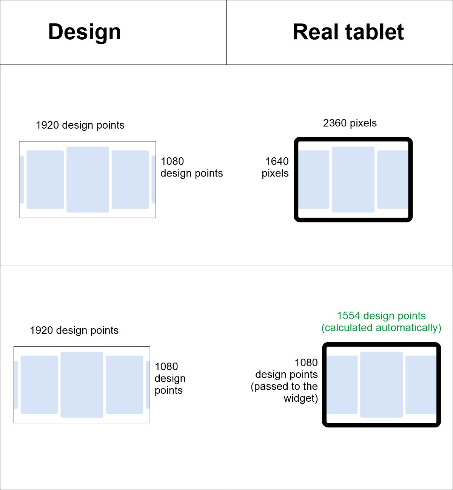

# plan_dimensions

A Flutter package that scales "design points" to flutter logical pixels

## Example:

There is a design (in Figma/Zeplin or any other tool) for tablets drawn with 1920x1080 dimensions, with the red square image that takes 0.27 of the screen height (300 pixels on the design).
In scope of this package these dimensions are called as **design points**.



When using the flutter logical pixels and hardcode the value of 300, the image will be displayed differently on different devices.
```dart
  Container(
    width: 300,
    height: 300,
    color: Colors.red,
  );
```
When using the above code, on the 8-inch tablet the image will take 0.47 of the screen height, while on the 10-inch tablet it will take 0.38. Looks weird:



The goal is to display the same image on 8-inch and 10-inch tablets, so it will take 0.27 of the screen height on both devices.
To do this, just wrap the app into the `PlanDimensionsWidget` (see [Usage](https://github.com/megamonster21099/plan_dimensions?tab=readme-ov-file#usage) section) and convert the image size **to flutter logical pixels** (toLp) like this:
```dart
  Container(
    width: 300.toLP,
    height: 300.toLP,
    color: Colors.red,
  );
```
As a result the image will take the same space on both devices:


 
# Usage

Add `plan_dimensions` in your pubspec.yaml.

```yaml
dependencies:
  plan_dimensions:
    git:
      url: https://github.com/megamonster21099/plan_dimensions
```

Wrap your app widget with the PlanDimensionsWidget and provide the designed dimensions for each device type (phone, tablet, desktop) in design points:
```dart
class MyApp extends StatelessWidget {
  const MyApp({super.key});

  @override
  Widget build(BuildContext context) {
    return PlanDimensionsWidget(
      phoneMinSideDesignPoints: 608.0, //The smallest side of the phone screen in design points
      tabletMinSideDesignPoints: 1080.0, //The smallest side of the tablet screen in design points
      desktopMinSideDesignPoints: 1444.0, //The smallest side of the desktop screen in design points
      child: MaterialApp(
        .........................................
      ),
    );
  }
}
```

Use your design points in the code and convert them to flutter logical pixels using the `toLP` extension:
```dart

  final double appbarHeight = 112.5.toLP;

  ///////////////////////////////////////
  
  Image.asset(
    'assets/logo.png',
    width: 200.toLP,
    height: 120.toLP,
  ),

  ///////////////////////////////////////
  
  Container(
    width: 300.0.toLP,
    height: 300.0.toLP,
    color: Colors.red,
  );

```

# Explanation

## Configuring the PlanDimensionsWidget

To know how designer made the design for each device type, the `PlanDimensionsWidget` needs to get the smallest side of the designed screen.
Eg. if the design for phones is 608x1080, then pass 608 as a `phoneMinSideDesignPoints` argument to the `PlanDimensionsWidget`:

```dart
PlanDimensionsWidget(
  phoneMinSideDesignPoints: 608.0,
.........................................
```

The other side of the phone will be calculated automatically:



The same for tablets. If the design for tablets is 1080x1920, then pass 1080 as a `tabletMinSideDesignPoints` argument to the `PlanDimensionsWidget`:
```dart
PlanDimensionsWidget(
  tabletMinSideDesignPoints: 1080.0,
.........................................
```

The other side of the phone will be calculated automatically:



## Getting dimensions in the code

Use the `PlanDimens()` singleton object every time you want to get the actual dimensions
```dart
    //The actual screen size in flutter logical pixels.
    final double sW = PlanDimens().screenWidth;
    final double sH = PlanDimens().screenHeight;
    
    //The screen size in design points. This value may be one of:
    // - the shortest side of the design you passed during initialization
    // - the other side calculated automatically based on the device aspect ratio
    //In most cases you don't need this information during development.
    final double dW = PlanDimens().designPointsWidth;
    final double dH = PlanDimens().designPointsHeight;
```